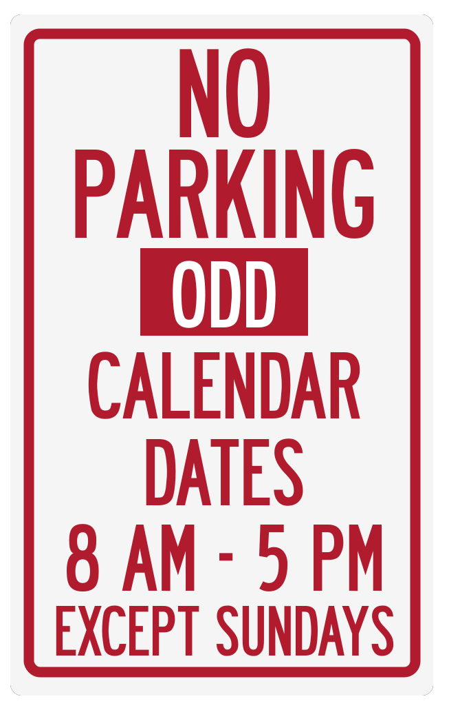

# Where Can I Park?

A progress web app built to assist in street parking in Iowa City, IA.

## The Problem

The rules surrounding parking on some streets in Iowa City, IA is difficult for residents to determine the optimal side to park on.

<figure>
  

    
  

  <figcaption>
    

      A representation of the sign causing confusion.
    

  </figcaption>
</figure>

## The Solution

An offline first, progressive web app to calculate the optimal place to park at any given time.  

<figure>
  

    
  

  <figcaption>
    

      Live at https://wherecanipark.netlify.com/.
    

  </figcaption>
</figure>
